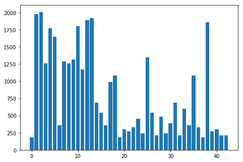
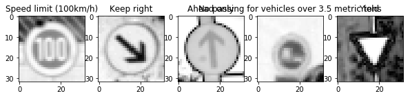
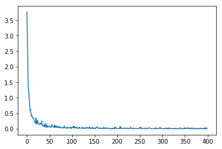
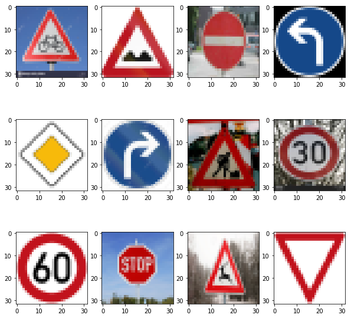

# **Traffic Sign Classification**

## Goals of The Project

* Understand the German Traffic Sign dataset.
* Build a deep neural network to perform traffic sign classification.
* Test the network on new images found on the web.
* Analyze results.

## Code Structure

The main program jupyter notebook is ./Traffic_Sign_Classifier.ipynb.

The HTML of the notebook run result is ./Traffic_Sign_Classifier.html.

The new images are under the folder ./newimages

## Data Summary

Number of training examples = 34799

Number of validation examples = 4410

Number of testing examples = 12630

Image data shape = (32, 32, 3)

Number of classes = 43

Showing five random images in the training data:

Showing the number of classes and the counts in training data:

## Data Preprocessing

We are doing three steps of data preprocessing.

First, the 3 channels RGB image is converted into a single channel grayscale image. This works well for LeNet5 according to the article, also a single channel makes training the network faster.

Second, all images are normalized to have zero mean and values -1 to 1. This will speed up training and also make gradient descent easier to converge.

Last, the images are shuffled into a random order.

Showing five random images in the training data after preprocessing:

## Model Architecture

We use the LeNet5 as our model, with the following layers:

Layer 1: Convolutional. Input = 32x32x1. Output = 28x28x6

->

ReLu Activation

->

Max Pooling. Input = 28x28x6. Output = 14x14x6

->

Layer 2: Convolutional. Output = 10x10x16.

->

ReLu Activation

->

Max Pooling. Input = 10x10x16. Output = 5x5x16

->

Layer 3: Fully Connected. Input = 400. Output = 120

->

ReLu Activation

->

Dropout

->

Layer 4: Fully Connected. Input = 120. Output = 84

->

ReLu Activation

->

Dropout

->

Layer 5: Fully Connected. Input = 84. Output = 43

We use softmax cross entropy as the cost function. We use the Adam optimizer as an optimization tool. We use the following hyperparameters for training.

learning rate = 0.0008

epochs = 200

batch size = 256

## Training and Testing

After training we achieved:

EPOCH 200 Validation Accuracy 0.964399: 100%|█████████▉| 199/200 [04:31<00:01,  1.37s/it]

The loss diagram is:

The test accuracy is 0.941.

## Testing On New Images

We find 12 new german traffic sign images on the web.

We use the trained classifier to classify them and get the following results:

Label  [30 22 17 34 12 33 11  1  3  3 31 13]

Probability  [ 0.96958882  1.          1.          0.99441904  1.          1.
  0.99999988  1.          0.93432832  0.99996281  0.99999225  1.        ]

Class  ['Beware of ice/snow', 'Bumpy road', 'No entry', 'Turn left ahead', 'Priority road', 'Turn right ahead', 'Right-of-way at the next intersection', 'Speed limit (30km/h)', 'Speed limit (60km/h)', 'Speed limit (60km/h)', 'Wild animals crossing', 'Yield']

The detect rate is 75%.

The detect rate is lower than the test accuracy. In my opinion, there are several possible causes. First, the training and testing data are skewed. According to the classes and count diagram, some classes have more training samples than others. Second, some of the images downloaded from web have different perspectives while most of the data in the training set are front views. Third, there is larger variance in brightness and color distribution among the downloaded images.

The top five probability for each image are:

Image 0

Beware of ice/snow : 0.969589

Slippery road : 0.030387

Children crossing : 0.000009

Dangerous curve to the right : 0.000008

Right-of-way at the next intersection : 0.000006

Image 1

Bumpy road : 1.000000

Dangerous curve to the right : 0.000000

Bicycles crossing : 0.000000

Road work : 0.000000

Speed limit (20km/h) : 0.000000

Image 2

No entry : 1.000000

Turn left ahead : 0.000000

No passing : 0.000000

Stop : 0.000000

Go straight or left : 0.000000

Image 3

Turn left ahead : 0.994419

Keep right : 0.005453

Beware of ice/snow : 0.000102

Right-of-way at the next intersection : 0.000026

Ahead only : 0.000000

Image 4

Priority road : 1.000000

No passing : 0.000000

Ahead only : 0.000000

End of no passing : 0.000000

No vehicles : 0.000000

Image 5

Turn right ahead : 1.000000

Stop : 0.000000

Yield : 0.000000

Speed limit (70km/h) : 0.000000

Double curve : 0.000000

Image 6

Right-of-way at the next intersection : 1.000000

Beware of ice/snow : 0.000000

Double curve : 0.000000

Road work : 0.000000

Slippery road : 0.000000

Image 7

Speed limit (30km/h) : 1.000000

End of speed limit (80km/h) : 0.000000

Speed limit (50km/h) : 0.000000

Speed limit (80km/h) : 0.000000

Speed limit (20km/h) : 0.000000

Image 8

Speed limit (60km/h) : 0.934328

Speed limit (30km/h) : 0.059959

Speed limit (50km/h) : 0.005712

Keep right : 0.000000

Speed limit (80km/h) : 0.000000

Image 9

Speed limit (60km/h) : 0.999963

Slippery road : 0.000023

No passing : 0.000013

Turn left ahead : 0.000001

No passing for vehicles over 3.5 metric tons : 0.000000

Image 10

Wild animals crossing : 0.999992

Double curve : 0.000008

Slippery road : 0.000000

Road work : 0.000000

Speed limit (60km/h) : 0.000000

Image 11

Yield : 1.000000

Speed limit (20km/h) : 0.000000

Speed limit (30km/h) : 0.000000

Speed limit (50km/h) : 0.000000

Speed limit (60km/h) : 0.000000

From the top 5 probabilities of the predictions for each image, the highest probability is almost 1 and the others are almost 0. The model is pretty certain about its predictions. I think this is because the traffic signs themselves are different from each other, and the network architecture we use here is small.

## Potential Shortcomings and Improvements

One shortcomings of the solution is the LeNet5 is a relatively simple network. It may not be the most efficent network for traffic sign classfication.

Future improvement of including doing data augmentation, modifying the LeNet architecture and trying out other networks.